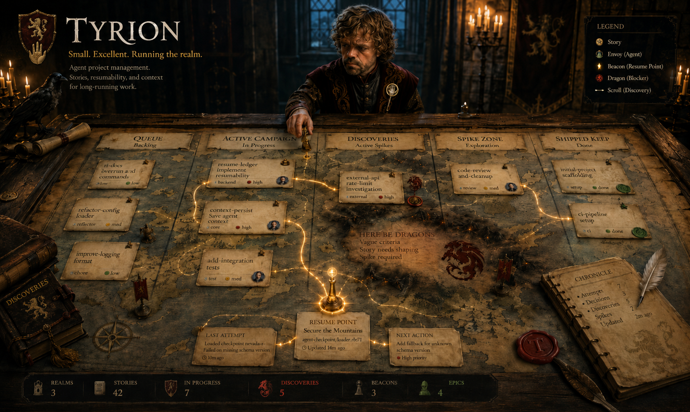
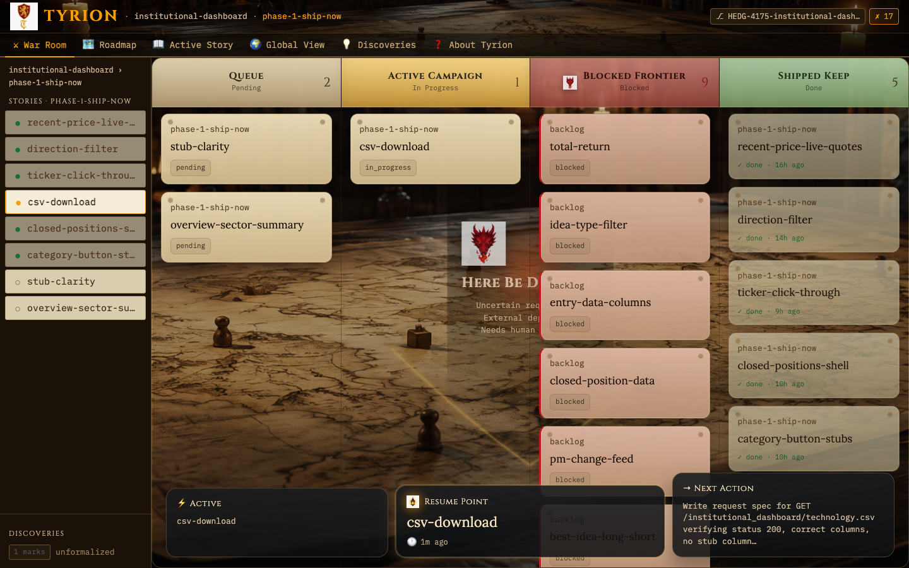
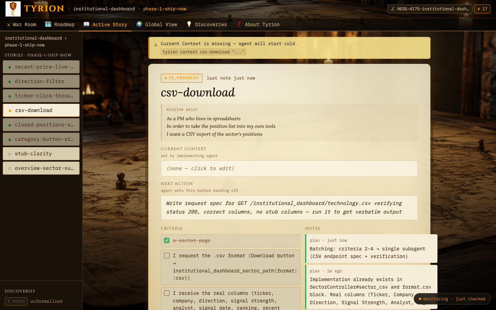
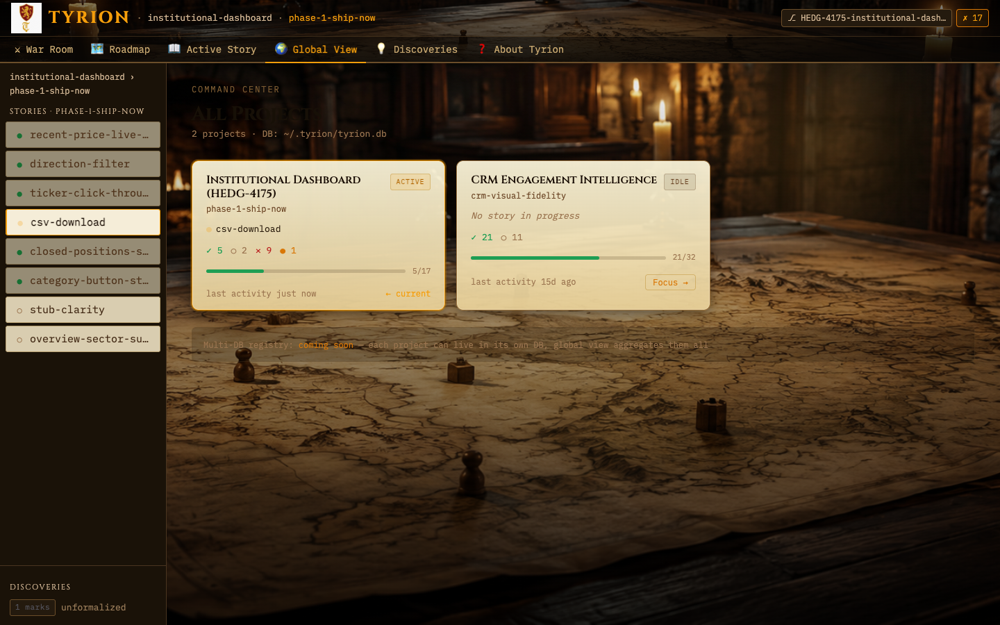

# Tyrion



> *"I drink and I know things."* — Tyrion Lannister, Hand of King and Queen

**Small. Excellent. Running the realm.**

Most project tools are built for empires — sprawling, political, and staffed by people whose full-time job is updating them. Tyrion is built for the war room. The 20% of project management that does 80% of the work, sharp enough to actually get used.

It answers one question brutally well:

> *What was I building, what's done, and what does the next agent do first?*

---

## When sessions end, context dies

Every coding session ends. Claude compacts. You context-switch. A fresh agent arrives at the gates — no map, no history, no record of what was tried and why it failed.

You end up re-explaining decisions that were already made, rediscovering dead ends, or worse: silently starting over while thinking you're continuing.

The traditional fix is handoff notes. Writing them takes discipline you don't have mid-sprint. Reading them is friction you don't want when you're trying to get back in flow.

Tyrion is the ledger that writes itself. **The Hand always remembers.**

---

## Running the realm

Tyrion gives your project a spine:

- **Projects → Epics → Stories → Criteria** — maps directly to Gherkin feature files. Import a `.feature` file and the stories are created, acceptance criteria and all.
- **Resume state** — every story tracks `current_context` and `next_action`. A new agent runs `tyrion resume` and knows exactly where to start.
- **The war room** — `tyrion status` shows the full plan view: what's pending, what's in flight, what's done, what's being investigated.
- **`tyrion pocket`** — a compact briefing of the current story and next action, made for agent handoff.

---

## Install

> **The gem is not yet published.** Tyrion is under active development — install from source until it stabilizes.

```bash
git clone https://github.com/fkchang/tyrion
cd tyrion && gem build tyrion.gemspec && gem install tyrion-*.gem
```

Your ledger lives at `~/.tyrion/tyrion.db`. Override with `TYRION_DB_PATH`.

### Codex (and other agents that read `~/.agents/skills`)

The skills are plain SKILL.md files, so any agent with native skill discovery can use them
directly. One command wires it up:

```bash
tyrion setup-codex        # symlinks the skills into ~/.agents/skills/tyrion
```

Restart the Codex CLI and `tyrion-shape`, `tyrion-implement`, `tyrion-orchestrate`, etc. appear
as first-class skills. Re-running is safe (idempotent). Skill text that names Claude-Code-only
helpers (`/pre-push`, `/design-review`) degrades to instructions the agent follows with its own
tools — strict-mode TDD explicitly covers the no-Skill-tool case.

---

## Take the black

```bash
# Register this repo
tyrion init

# Create and activate a project
tyrion project new myapp "My App"
tyrion project activate myapp

# Import your Gherkin feature file → stories + criteria
tyrion import features/myapp.feature

# The war room
tyrion status

# Claim a story and ride
tyrion start my-first-story

# Send ravens as you go
tyrion note my-first-story progress "OAuth flow done, writing tests"
tyrion context my-first-story "Auth implemented. Tests next."
tyrion next my-first-story "Write the integration test"

# Mark criteria done — with evidence, not hearsay
tyrion check my-first-story 1 "oauth_spec.rb:42 — rspec spec/auth → PASSED"

# Hand off to the next agent
tyrion pocket          # compact briefing
tyrion resume          # full context dump

# Close it out — leave a briefing for whoever comes next
tyrion done my-first-story "OAuth done. Next: token refresh."
```

---

## Ravens & reconnaissance

Good campaigns don't travel in straight lines. You're mid-story and spot something that will matter later. You have a known unknown that needs investigation before you can commit to an approach. Tyrion tracks the exploratory layer without making it a court proceeding.

```bash
# Spot something worth remembering — log it instantly
tyrion mark "the N+1 on project list will hurt at scale"

# Frame a known unknown
tyrion spike start "Is SQLite WAL fast enough under concurrent agents?"

# Investigate, then close with findings
tyrion spike done
# → prompts: finding, confidence (low/medium/high), recommendation

# Promote a finding to a tracked story, with full lineage
tyrion spike promote disc-001

# Survey the reconnaissance backlog
tyrion discovery list --status ready
```

Each `spike promote` creates a story with `born_from_discovery` set — full traceability from question to shipped feature.

This is **SDRD** (Spike-Driven Requirements Discovery) made explicit: explore first, formalize what you learned. The discovery layer is that loop with a spine.

---

## The scrolls don't lie

Tyrion imports Gherkin. Write your acceptance criteria as `Given/When/Then` — Tyrion creates the stories and criteria. Reimport any time to sync.

```gherkin
Feature: Auth
  Scenario: user-login
    Given a registered user with valid credentials
    When they POST /auth/login
    Then they receive a JWT and a 200 response
```

```bash
tyrion import features/auth.feature
tyrion status
# → user-login  pending  [0/3 criteria]
```

Criteria require evidence, not assertions:

```bash
tyrion check user-login 1 "auth_spec.rb:42 — rspec spec/auth → PASSED"
```

---

## Key commands

```
tyrion status                    The war room — plan view
tyrion resume [slug]             Full context dump for a story
tyrion pocket                    Compact briefing for agent handoff

tyrion start <slug>              Claim a story
tyrion block <slug> "reason"     Mark a story blocked (shows in war room BLOCKED lane)
tyrion unblock <slug>            Clear the block — back to pending
tyrion note <slug> <kind> "..."  Send a raven (kinds: plan|progress|decision|blocker|handoff|followup)
tyrion notes <slug> [--kind <k>] Full note dump — untruncated bodies (complement to tyrion show)
tyrion context <slug> "..."      Update what's currently understood
tyrion next <slug> "..."         Update the next concrete action
tyrion reconcile <slug> [flags]  Atomic sync: update context + next + add note (+ optional --check)
tyrion check <slug> <n> "..."    Mark a criterion done with evidence
tyrion done <slug> "summary"     Close the campaign

tyrion followup list <slug>      Show open followup notes for a done story
tyrion followup resolve <slug> N Mark followup #N resolved (removes from NEEDS FOLLOW-UP)

tyrion depends add <slug> <dep>  Record that <slug> must run after <dep>
tyrion depends rm <slug> <dep>   Remove a dependency
tyrion wave show                 Show wave plan — topological layers derived from depends_on
tyrion wave set <slug> <N> [why] Pin story to wave N regardless of topo sort (wave_source=user)
tyrion wave next                 Print first fully-pending wave as newline-delimited slugs
tyrion wave next --with-pocket   Same, with tyrion pocket briefing appended below each slug

tyrion mark "desc"               Instant reconnaissance bookmark
tyrion spike start "question"    Frame a known unknown
tyrion spike done                Close with findings
tyrion spike promote <disc-id>   Promote finding → story
```

`tyrion help` for the full scroll.

---

## The war room, on any screen

Once you have a project in Tyrion, start the web UI and monitor active work from your phone, a second monitor, or any device on your Tailscale network — without touching the Claude Code session.

```bash
tyrion web
# → starts (or reuses) the server, opens http://localhost:4579 in your browser
# tyrion web restart / stop / status also work; alias: tyrion dashboard
```

(Requires a source checkout — `web/` isn't packaged into the gem. Manual equivalent: `cd web && TYRION_PROJECT=<slug> bundle exec ruby app.rb`.)

**War Room** — kanban across all four lanes (Queue · Active Campaign · Blocked Frontier · Shipped Keep). See what's pending, what's stuck, and what shipped.



**Active Story** — the full briefing for whatever is in progress: MISSION BRIEF (the Gherkin "As a / In order to / I want"), current context set by the implementing agent, next action, criteria checklist, and recent notes. Polls every 30 seconds and reloads automatically when the agent updates anything — so you can watch work progress without switching windows.



**Global View** — health cards for every project in the DB: active epic, story in progress, done/pending/blocked counts, last activity, and a quick Focus link to switch context.



---

## A Lannister always pays his debts

Tyrion is built on one principle: **if the tool requires discipline to use, it's already lost**.

The CLI is complete and scriptable — every command does one thing precisely. But remembering to run `tyrion note`, `tyrion context`, and `tyrion next` at the right moment is exactly the kind of discipline that evaporates at 2am mid-sprint. Every forgotten step is the ledger going stale.

The answer is the **Claude Code skills** layer. Eight skills that orchestrate the CLI so you don't have to. The CLI is the engine. The skills are the driver. Every rough edge that surfaces in real use gets folded back in — Tyrion gets easier over time, which is the opposite of how most tools work.

---

## The skills

Eight skills, one coherent workflow. Each one calls the CLI commands you'd otherwise forget.

### The natural sequence

```
/tyrion-orient       → start of any session — where are we?
/tyrion-new          → bootstrap a project from scratch
/tyrion-shape        → turn documents into stories
/tyrion-import       → load a reviewed feature file into the DB
/tyrion-add-story    → add one story mid-epic
/tyrion-implement    → implement a story, start to finish
/tyrion-orchestrate  → fan out one subagent per story; advance waves until epic done
/tyrion-checkpoint   → save state before /compact or session end
```

### Starting from a rough idea? Use superpowers as the front-end

Tyrion doesn't reimplement brainstorming or planning — if you have the
[superpowers](https://github.com/obra/superpowers) plugin installed, the recommended flow for new
work is:

```
superpowers:brainstorming    → collaborative design, spec written to docs/superpowers/specs/
superpowers:writing-plans    → bite-sized TDD plan written to docs/superpowers/plans/
/tyrion-shape --from <plan>  → plan ingested: tasks become stories, epic gets a Plan file: line
/tyrion-implement            → tracked execution with the ledger, gates, and resumability
```

Superpowers owns the brainstorm/plan/TDD/review discipline. Tyrion owns what superpowers loses at
session end: the durable ledger, resumability across `/clear`, and gate traceability (pre-push
results, review verdicts, commits — see `tyrion gate`). `/tyrion-shape` recognizes superpowers
plan documents natively, and strict-mode subagents run `superpowers:test-driven-development`.

---

### `/tyrion-orient` — session start

```
/tyrion-orient
```

Read-only. No mutations. Answers "where are we?" at the top of any session.

```bash
tyrion init          # ensure this repo is registered
tyrion status        # plan view: project + epic + stories + git state
tyrion resume        # if a story is in_progress: context dump, next action, recent notes
```

---

### `/tyrion-new` — bootstrap a project in one shot

```
/tyrion-new
```

Answer seven questions (project slug, name, description, epic slug, name, intent, first stories). The skill handles the rest:

```bash
tyrion init
tyrion status
tyrion project new <slug> "Name"
tyrion project activate <slug>
# writes .tyrion/projects/<slug>/ABOUT.md
# writes features/<epic-slug>.feature with first stories
tyrion import features/<epic-slug>.feature
tyrion epic activate <epic-slug>
tyrion status                          # verify: project + epic + stories live
```

One conversation → registered project, imported stories, ready to implement.

---

### `/tyrion-shape` — turn documents into stories

```
/tyrion-shape --from PRD.md research-notes.md
```

Feed it any documents — PRDs, brainstorm transcripts, meeting notes, scored scenario tables. The skill reads them, extracts project ABOUT material, epic intent, and stories with criteria, writes drafts for human review, then imports on approval.

```bash
tyrion init
tyrion status
# reads all --from docs
# writes .tyrion/projects/<slug>/ABOUT.md  (shows diff if it already exists)
# writes features/<epic-slug>.feature
# shows full draft inline → awaits "yes / edit: <feedback> / abort"
tyrion import features/<epic-slug>.feature   # only runs on "yes"
tyrion status
```

Vague scenarios get `# TODO: criteria` markers — sharpened interactively during `/tyrion-implement` step 4, when the implementation context makes the right criteria obvious.

---

### `/tyrion-import` — deterministic loader

```
/tyrion-import
```

The focused version of shape's import step — for when you've already reviewed or edited the `.feature` file manually.

```bash
tyrion init
tyrion import features/<epic-slug>.feature
tyrion epic activate <epic-slug>
tyrion status
```

Safe to re-run on the same file. Idempotent by SHA256 hash; use `--force` when only non-story content changed.

---

### `/tyrion-add-story` — one story, mid-epic

```
/tyrion-add-story
```

Describe a story in plain language. The skill writes the scenario into the existing feature file, shows it for approval, and imports:

```bash
tyrion show <epic-slug>                       # reads current epic context
# writes new Scenario block into features/<epic-slug>.feature
# shows the new scenario inline → awaits approval
tyrion import features/<epic-slug>.feature --force
tyrion status
```

---

### `/tyrion-implement` — one story, start to finish

```
/tyrion-implement my-first-story
/tyrion-implement my-first-story --spike        # exploration, no quality gate
/tyrion-implement my-first-story --tdd=strict   # failing test must come first
```

The heavy lifter. Nine steps, fully orchestrated. Here's what it calls:

**Orient + claim:**
```bash
tyrion init && tyrion status && tyrion project show && tyrion epic show
tyrion show <slug>
tyrion epic activate <epic-slug>   # auto-activates if the story is in a different epic
tyrion start <slug>                # transactional — refuses if another story is already in_progress
```

**Resume + plan:**
```bash
tyrion resume <slug>               # reads current_context, next_action, unchecked criteria
tyrion show <slug>
tyrion criteria add <slug> --given "..." --when "..." --then "..."   # if criteria need sharpening
tyrion note <slug> plan "<implementation plan>"
tyrion next <slug> "<first concrete action>"
```

**Per-criterion loop** (spawns a fresh subagent per criterion):
```bash
# Continuous capture — before anything else on each turn
tyrion note <slug> progress "user requested: <exact request verbatim>"

# After the criterion is implemented:
tyrion note <slug> progress "<files changed, verbatim test output>"
tyrion check <slug> <position> "<evidence — test command + verbatim output>"
tyrion context <slug> "<what's done, what's pending>"
tyrion next <slug> "<next concrete action>"
```

**UAT runbook + quality gate + close:**
```bash
tyrion note <slug> handoff "<per-criterion runbook: exact commands + expected output>"
# /pre-push  (build/strict modes — tests + code review + docs + AI slop check)
tyrion done <slug> "<completion summary>"
tyrion status
```

Every step that a human would forget — logging the note, updating context, checking the criterion with evidence — the skill runs automatically. The story closes with a complete, re-verifiable evidence trail.

---

### `/tyrion-checkpoint` — save state before clearing context

```
/tyrion-checkpoint
```

An interrupt, not a lifecycle step. Run before `/compact`, `/clear`, or ending a session mid-story. Persists everything so the next agent can resume exactly.

```bash
tyrion resume <slug>               # read what's currently understood
tyrion note <slug> progress "<what was just done>"
tyrion context <slug> "<current state>"
tyrion next <slug> "<where to start next session>"
# if criteria were just met but not checked:
tyrion check <slug> <position> "<evidence>"
```

The next session runs `/tyrion-orient`, reads the checkpoint, and picks up without re-explaining anything.

---

Tyrion was built during a SDRD session, when the handoff-doc problem became painful enough that building the solution was the right next spike. A tool born from its own use case, running the realm it was built for.

---

## Forget the steps. The Hand remembers.

You're juggling too many things. You switch contexts. You forget what you were building, what the next command is, whether you ran that check. That's fine — remembering is Tyrion's job. Yours is to show up.

**Once per project:**
```
/tyrion-new                        # bootstrap from scratch
/tyrion-shape --from PRD.md        # or shape from documents
```

**Once per story — repeat until the epic is done:**
```
/tyrion-implement    # claim, build, UAT, close
/clear               # scrub context, start fresh
```

The skill handles every step you'd forget: orient, plan, note, context, check, handoff, pre-push, done. You review the UAT output and say whether it's right.

### More effort, better results

**Save time between sessions** — `/tyrion-implement` pre-claims the next pending story automatically when it closes one out. The next session sees it already `in_progress` and resumes in two commands instead of reasoning about what to work on.

**Shape it toward great** — `/tyrion-implement` pauses at UAT and waits for you. That pause is the quality gate. Review what the agent built. "This button is in the wrong place." "The error message is confusing." Each correction closes the gap between what the agent inferred and what you actually meant.

Per SDRD, you can't one-shot great — you discover what great looks like through the feedback loop. The skill runs the campaign. You decide whether the campaign was worth running.

> *A Warden holds the land. A Hand shapes the realm.* The loop ships stories. The loop with guidance ships something worth shipping.

### Dark factory

`--dark-factory` — the agent runs UAT itself and closes the story without you. No pause, no review, no steering. The work ships.

```
/tyrion-implement my-story --dark-factory
```

`--adequate` if you're being generous. `--mediocre` if you're being honest. Use it when "done" is the bar, not "great."

This is distinct from `--spike`, which skips the quality gate entirely because spike output is disposable. `--dark-factory` still runs UAT — the agent just reviews its own work. Meant to ship; you're just not in the loop.

For full hands-off runs, pair with a `/goal` directive to drive an entire epic unattended.

---

## License

MIT
